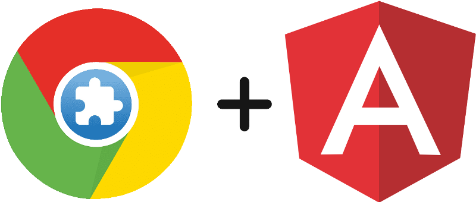
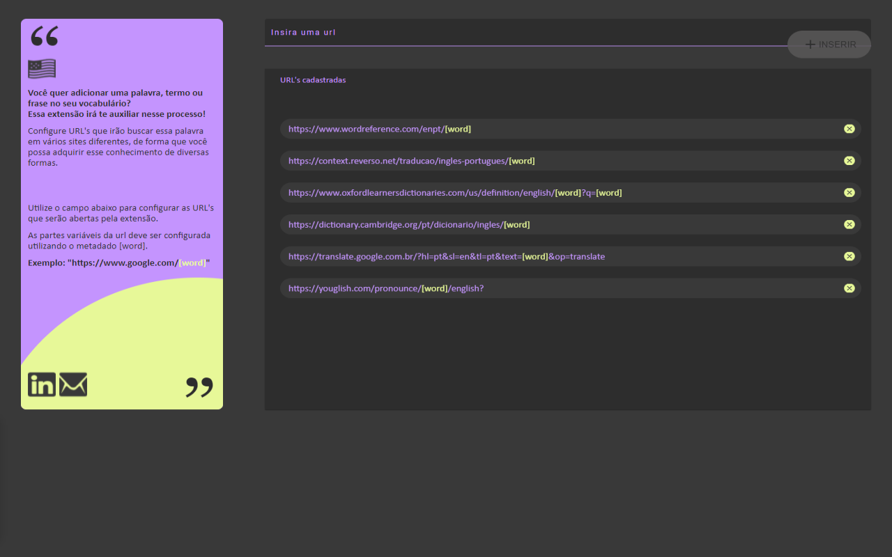

<div align="right">

[](README.md)
[](README-ENG.md)

</div>

<p align="center">
  
</p>

<p align="center">   
  
     
  <a href="https://github.com/gleisonkz">
    
  </a>  
  
       
</p>

<p align="center">
 <a href="#eye_speech_bubble-preview">Preview</a> •
 <a href="#information_source-about">About</a> •
 <a href="#arrow_forward-run">Run</a> •
 <a href="#hammer_and_wrench-technologies">Technologies</a> • 
 <a href="#brain-applied-concepts">Concepts</a> •
 <a href="#sparkles-features">Features</a> •
 <a href="#boy-author">Author</a> •
 <a href="#balance_scale-license">License</a>
</p>

---

## :eye_speech_bubble: **Preview**

<div align="center">

Extension deployed at [Chrome Web Store](https://chrome.google.com/webstore/category/extensions) to see: [Click Here](https://chrome.google.com/webstore/detail/i%2B1-helper/pahefalbpfookcihpfalcoalamcbggme?hl=en&authuser=0)

|                             :computer:Desktop                             |
| :-----------------------------------------------------------------------: |
| <kbd></kbd> |

</div>
  
---

## :information_source: About

<div align="center">

Extension built to automat search for English word definitions and audios using chrome.

I'm an English learner, and I use the [Sentence Mining](https://www.youtube.com/playlist?list=PLl_7J18zHKKCwoplWshSDTDmWrvez27Qr) technique touch by Mairo Vergara to built I+1 phrases.

My goal was to automate part of this process, so I built this extension.

This extension allow you to search for an English word into a set o URL's by user configuration using the metadata [word].

---

</div>

## :arrow_forward: **Run**

<div align="center">

To run this project you need to clone this repository, have the NOde Package Manager ([`NPM`](https://www.npmjs.com/get-npm)) or the YARN Package Manager ([`YARN`](https://yarnpkg.com/getting-started)) installed.

🌐 FrontEnd

Open the command prompt in the project directory at i-plus-one-helper-chrome-extension, and execute the following commands:

<details>
  <summary><i>with <b>npm</b></i></summary>
  
```bash
# Install dependencies

$ npm install ou npm i

# Build the extension

$ ng build

# Load on chrome the project built in dist folder

````

</details>

<details>
<summary><i>with <b>yarn</b></i></summary>

```bash
# Install dependencies
$ yarn install

# Build the extension

$ ng build

# Load on chrome the project built in dist folder

````

</details>

> ⚠️ To get hot-reload for testing extension in chrome use the command ng build --watch

</div>

---

## :hammer_and_wrench: **Technologies**

<div align="center">

|                                  :globe_with_meridians: FrontEnd                                  |
| :-----------------------------------------------------------------------------------------------: |
|                                 [Angular 11](https://angular.io/)                                 |
|                        [Angular Material 11](https://material.angular.io/)                        |
|                                  [SASS](https://sass-lang.com/)                                   |
|                        [TypeScript 4.0.2](https://www.typescriptlang.org/)                        |
|                           [Rxjs 6.6.0](https://rxjs.dev/guide/overview)                           |
|            [Chrome API ](https://developer.chrome.com/docs/extensions/mv3/getstarted/)            |
| [Custom Webpack Angular Builder ](https://www.npmjs.com/package/@angular-builders/custom-webpack) |

</div>

---

## :brain: **Applied Concepts**

<div align="center">

|       :page_facing_up:       |
| :--------------------------: |
|    Hash Location Strategy    |
|        Reactive Forms        |
|   Observable Data Service    |
| Chrome Background Script API |
|      Chrome Storage API      |
|  Custom Highlight Directive  |
|  Custom Error State Matcher  |

</div>

---

## :sparkles: **Features**

<div align="center">

|       :page_facing_up:        |
| :---------------------------: |
|  Search word on pre-set urls  |
|      Add and Remove urls      |
| Urls stored in Chrome Storage |

</div>

---

## :boy: **Author**

<div align="center">

<a href="https://github.com/gleisonkz">
 
 <br/>
 <sub><b>Gleison de Almeida</b></sub>
</a>

Developed with ❤️ by Gleison Almeida 👋🏽 Contact me!

[](https://www.linkedin.com/in/gleison-ribeiro-a65257119)
[](https://github.com/gleisonkz)
[](mailto:gleisonsubzerokz@gmail.com)

</div>

---

## :balance_scale: **License**

<div align="center">

Copyright © 2021 [Gleison Almeida](https://github.com/gleisonkz).<br />
This project is licensed by [MIT](./LICENSE).

</div>
