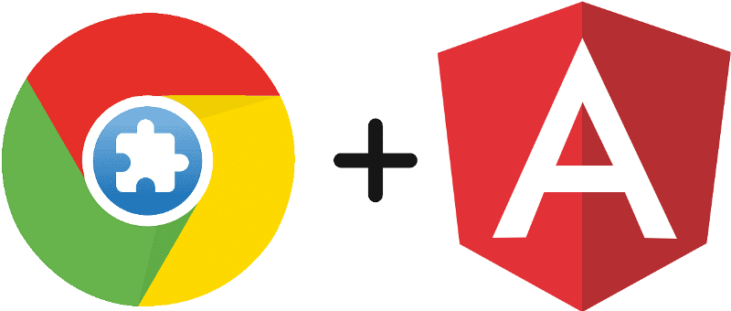
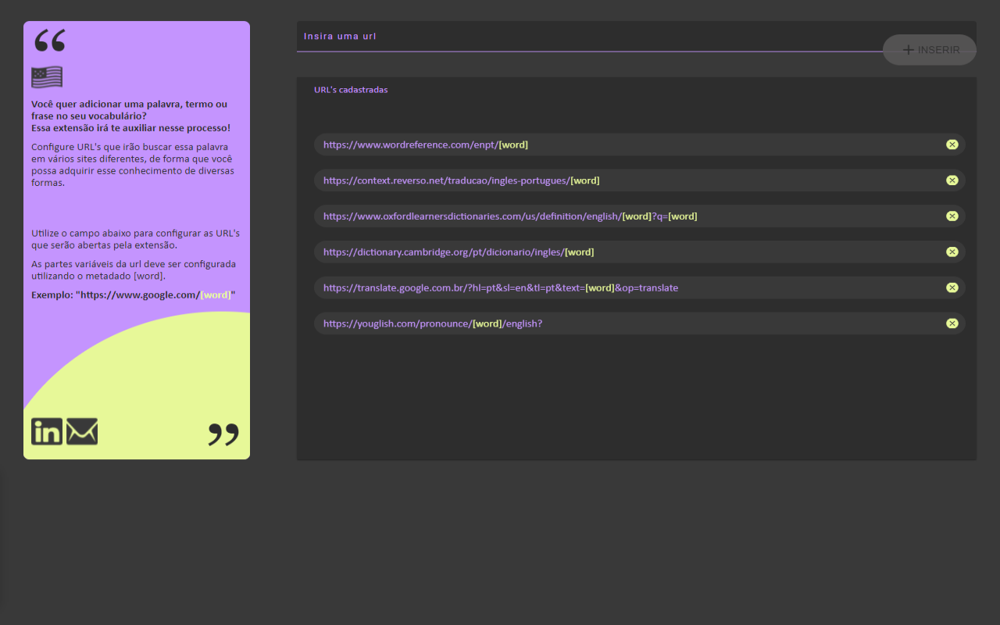

<div align="right">
  
  [](README.md)
  [](README-US.md)
  
</div>

<p align="center">
  
</p>

<p align="center"> 
  
     
  <a href="https://github.com/gleisonkz">
    
  </a>  
     
     
  
</p>

<p align="center">
 <a href="#eye_speech_bubble-visualizar">Visualizar</a> •
 <a href="#information_source-sobre">Sobre</a> •
 <a href="#arrow_forward-executar">Executar</a> •
 <a href="#hammer_and_wrench-tecnologias">Tecnologias</a> • 
 <a href="#brain-conceitos-aplicados">Conceitos</a> •
 <a href="#sparkles-funcionalidades">Funcionalidades</a> •
 <a href="#boy-autor">Autor</a> •
 <a href="#balance_scale-licença">Licença</a>
</p>

---

## :eye_speech_bubble: **Visualizar**

<div align="center">

A extensão encontra-se publicada na Chrome Web Store e pode ser baixada por este link [aqui](https://chrome.google.com/webstore/detail/i%2B1-helper/pahefalbpfookcihpfalcoalamcbggme?hl=en&authuser=0)

|                             :computer:Desktop                             |
| :-----------------------------------------------------------------------: |
| <kbd></kbd> |

</div>
  
---

## :information_source: Sobre

<div align="center">

Sou estudante de inglês e utilizo a técnica ensinada pelo Mairo Vergara de [mineração de sentenças](https://www.youtube.com/playlist?list=PLl_7J18zHKKCwoplWshSDTDmWrvez27Qr) para produção de frases I+1.

Com o objetivo de automatizar parte desse processo de busca criei está extensão.

Essa extensão permite realizar a busca de uma palavra em um conjunto de url's definidas pelo usuário na parte de configurações, utilizando como metadado a palavra [word].

---

</div>

## :arrow_forward: **Executar**

<div align="center">

Para executar esse projeto você precisa baixar este repositório, ter o Gerenciador de Pacotes do Node ([`NPM`](https://www.npmjs.com/get-npm)) ou o Gerenciador de Pacotes YARN ([`YARN`](https://yarnpkg.com/getting-started)) instalado.

🌐 FrontEnd

Abra o prompt de comando no diretório do projeto na pasta i-plus-one-helper-chrome-extension, e execute os seguintes códigos:

<details>
  <summary><i>com <b>npm</b></i></summary>
  
```bash
  
# Instalar dependências

$ npm install ou npm i

# Realizar o build da extensão

$ ng build

# Carregue o arquivo gerado pelo build na pasta dist, no seu gerenciador de extensões do chrome

````

</details>

<details>
<summary><i>com <b>yarn</b></i></summary>

```bash
# Instalar dependências

$ yarn install

# Realizar o build da extensão

$ ng build

# Carregue o arquivo gerado pelo build na pasta dist, no seu gerenciador de extensões do chrome

````

</details>

> ⚠️ Caso queira que a aplicação seja sempre atualizada enquanto testa no chrome basta usar o comando ng build --watch

</div>

---

## :hammer_and_wrench: **Tecnologias**

<div align="center">

|                                  :globe_with_meridians: FrontEnd                                  |
| :-----------------------------------------------------------------------------------------------: |
|                                 [Angular 11](https://angular.io/)                                 |
|                        [Angular Material 11](https://material.angular.io/)                        |
|                                  [SASS](https://sass-lang.com/)                                   |
|                        [TypeScript 4.0.2](https://www.typescriptlang.org/)                        |
|                           [Rxjs 6.6.0](https://rxjs.dev/guide/overview)                           |
|            [Chrome API ](https://developer.chrome.com/docs/extensions/mv3/getstarted/)            |
| [Custom Webpack Angular Builder ](https://www.npmjs.com/package/@angular-builders/custom-webpack) |

</div>

---

## :brain: **Conceitos Aplicados**

<div align="center">

|       :page_facing_up:       |
| :--------------------------: |
|    Hash Location Strategy    |
|        Reactive Forms        |
|   Observable Data Service    |
| Chrome Background Script API |
|      Chrome Storage API      |
|  Custom Highlight Directive  |
|  Custom Error State Matcher  |

</div>

---

## :sparkles: **Funcionalidades**

<div align="center">

|                    :page_facing_up:                     |
| :-----------------------------------------------------: |
| Pesquisa uma palavra/frase em todas as URLs cadastradas |
|                Adicionar e Deletar URLs                 |
|              URLs salvas na Chrome Storage              |

</div>

---

## :boy: **Autor**

<div align="center">

<a href="https://github.com/gleisonkz">
 
 <br/>
 <sub><b>Gleison de Almeida</b></sub>
</a>

Desenvolvido com ❤️ por Gleison Almeida 👋🏽 Meus Contatos!

[](https://www.linkedin.com/in/gleison-ribeiro-a65257119)
[](https://github.com/gleisonkz)
[](mailto:gleisonsubzerokz@gmail.com)

</div>

---

## :balance_scale: **Licença**

<div align="center">

Copyright © 2021 [Gleison Almeida](https://github.com/gleisonkz).<br />
This project is licensed by [MIT](./LICENSE).

</div>
